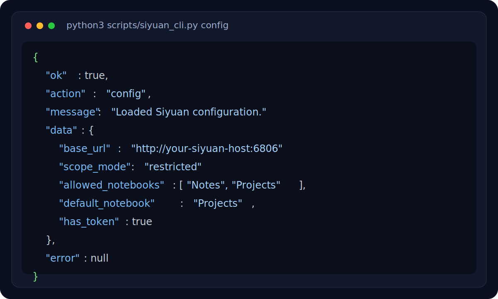

# siyuan-cli-skill

[](https://github.com/betterLitao/siyuan-cli-skill/actions/workflows/ci.yml)
[简体中文](README.zh-CN.md)


A reusable multi-file skill for **stable Siyuan document reads and writes**.

It wraps Siyuan Kernel APIs behind a Python CLI so assistants can avoid hand-writing request payloads for common document operations.

## Demo



## Features

- structured JSON output for every command
- read, search, update, append, create, delete document operations
- block-first `replace-section` / `upsert-section`
- explicit `create-doc --if-exists` conflict strategy
- read-back verification after writes
- UTF-8 file input support for long Markdown
- no third-party Python dependencies
- Windows and macOS / Linux friendly invocation

## Project structure

```text
siyuan-cli-skill/
├─ assets/
│  └─ demo-config.svg
├─ CHANGELOG.md
├─ LICENSE
├─ SKILL.md
├─ README.md
├─ references/
│  └─ api-contract.md
└─ scripts/
   ├─ siyuan_cli.py
   ├─ siyuan_client.py
   ├─ siyuan_config.py
   └─ siyuan_ops.py
```

## Why this exists

Directly calling Siyuan Kernel APIs from prompts is brittle:

- request bodies are easy to get wrong
- long Markdown is noisy to inline
- write verification is often skipped
- platform-specific encoding problems show up fast

This wrapper centralizes:

- environment-based auth
- content normalization
- block / document write flows
- read-back verification
- stable JSON contracts for automation

## Installation

### Option A: use it as a standalone CLI

Requirements:

- Python 3.9+
- a reachable Siyuan instance
- a valid Siyuan API token

Clone the repository:

```bash
git clone https://github.com/betterLitao/siyuan-cli-skill.git
cd siyuan-cli-skill
```

No `pip install` is required. The CLI uses only the Python standard library.

Set the required environment variables.

#### macOS / Linux

```bash
export SIYUAN_BASE_URL="http://your-siyuan-host:6806"
export SIYUAN_TOKEN="your-siyuan-token"
```

#### PowerShell

```powershell
$env:SIYUAN_BASE_URL = "http://your-siyuan-host:6806"
$env:SIYUAN_TOKEN = "your-siyuan-token"
```

Run a smoke test:

```bash
python3 scripts/siyuan_cli.py config
```

On Windows use:

```bash
python scripts/siyuan_cli.py config
```

### Option B: use it as a multi-file skill

Do **not** copy `SKILL.md` alone. Copy the whole directory.

Typical target layout:

```text
<your-skills-root>/siyuan/
├─ SKILL.md
├─ references/
└─ scripts/
```

Then invoke from the copied skill directory:

```bash
python scripts/siyuan_cli.py config
```

## Quick start

### Windows

```bash
python scripts/siyuan_cli.py config
python scripts/siyuan_cli.py search --query "API gateway"
python scripts/siyuan_cli.py read --doc-id "20260314140600-8gkfmc2"
python scripts/siyuan_cli.py update --doc-id "20260314140600-8gkfmc2" --input-file "content.md"
python scripts/siyuan_cli.py replace-section --doc-id "20260314140600-8gkfmc2" --heading "Summary" --input-file "section.md"
python scripts/siyuan_cli.py create-doc --notebook "Projects" --path "Guides/API Wrapper" --input-file "content.md"
python scripts/siyuan_cli.py delete-doc --path "Scratch/Test Doc" --notebook "Inbox" --yes
```

### macOS / Linux

```bash
python3 scripts/siyuan_cli.py config
python3 scripts/siyuan_cli.py search --query "API gateway"
python3 scripts/siyuan_cli.py read --doc-id "20260314140600-8gkfmc2"
python3 scripts/siyuan_cli.py update --doc-id "20260314140600-8gkfmc2" --input-file "content.md"
python3 scripts/siyuan_cli.py replace-section --doc-id "20260314140600-8gkfmc2" --heading "Summary" --input-file "section.md"
python3 scripts/siyuan_cli.py create-doc --notebook "Projects" --path "Guides/API Wrapper" --input-file "content.md"
python3 scripts/siyuan_cli.py delete-doc --path "Scratch/Test Doc" --notebook "Inbox" --yes
```

## Path handling notes

- When using Windows Git Bash, do **not** start Siyuan paths with `/`.
- Prefer `Guides/API Wrapper` over `/Guides/API Wrapper`.
- Path normalization will:
  - convert `\` to `/`
  - remove `.sy`
  - trim whitespace around separators
  - normalize to Siyuan-style hpaths internally

## Environment variables

Required:

- `SIYUAN_BASE_URL` or `SIYUAN_URL` or `SIYUAN_REMOTE_URL`
- `SIYUAN_TOKEN`

Optional:

- `SIYUAN_TIMEOUT`
- `SIYUAN_ALLOWED_NOTEBOOKS`
- `SIYUAN_LEARN_NOTEBOOKS`

### Example: macOS / Linux

```bash
export SIYUAN_BASE_URL="http://your-siyuan-host:6806"
export SIYUAN_TOKEN="your-siyuan-token"
export SIYUAN_ALLOWED_NOTEBOOKS="Notes,Projects"
export SIYUAN_LEARN_NOTEBOOKS="Notes"
```

### Example: PowerShell

```powershell
$env:SIYUAN_BASE_URL = "http://your-siyuan-host:6806"
$env:SIYUAN_TOKEN = "your-siyuan-token"
$env:SIYUAN_ALLOWED_NOTEBOOKS = "Notes,Projects"
$env:SIYUAN_LEARN_NOTEBOOKS = "Notes"
```

## Scope behavior

Notebook scope is **config-driven**, not hard-coded.

- If `SIYUAN_ALLOWED_NOTEBOOKS` is set, operations are restricted to that whitelist.
- If `SIYUAN_ALLOWED_NOTEBOOKS` is empty, the CLI does not enforce a notebook whitelist.
- `create-doc` can omit `--notebook` only when a default notebook can be resolved from:
  - `SIYUAN_LEARN_NOTEBOOKS` with `--purpose learn`
  - or the first value in `SIYUAN_ALLOWED_NOTEBOOKS`
- Otherwise `create-doc` fails and requires `--notebook`.

## Auth model

This project uses token-based API auth.

Important:

- request auth is driven by `SIYUAN_TOKEN`
- `accessAuthCode` is mainly related to Siyuan service exposure / startup config
- it is **not** the header this CLI uses for normal API requests

## Release notes

See [`CHANGELOG.md`](CHANGELOG.md).

Current public baseline: **v1.0.0**.

## Write strategy

All write flows follow the same pattern:

1. load Markdown (`--input-file` preferred for long content)
2. normalize line endings to `\n`
3. strip invalid control characters
4. call the corresponding Siyuan API
5. read back the document
6. verify the result
7. return structured JSON

## Notes for maintainers

- keep `SKILL.md` focused on usage strategy
- keep `references/api-contract.md` focused on CLI contract details
- keep `scripts/` as the stable execution layer
- if you redistribute the skill, copy the whole directory rather than `SKILL.md` alone
